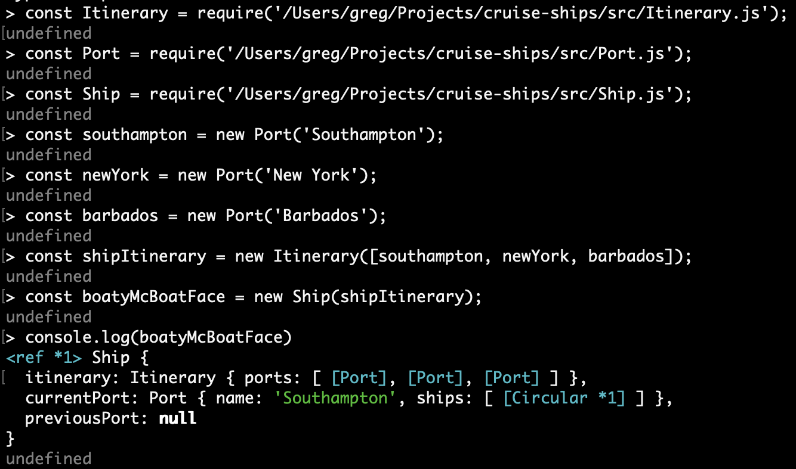
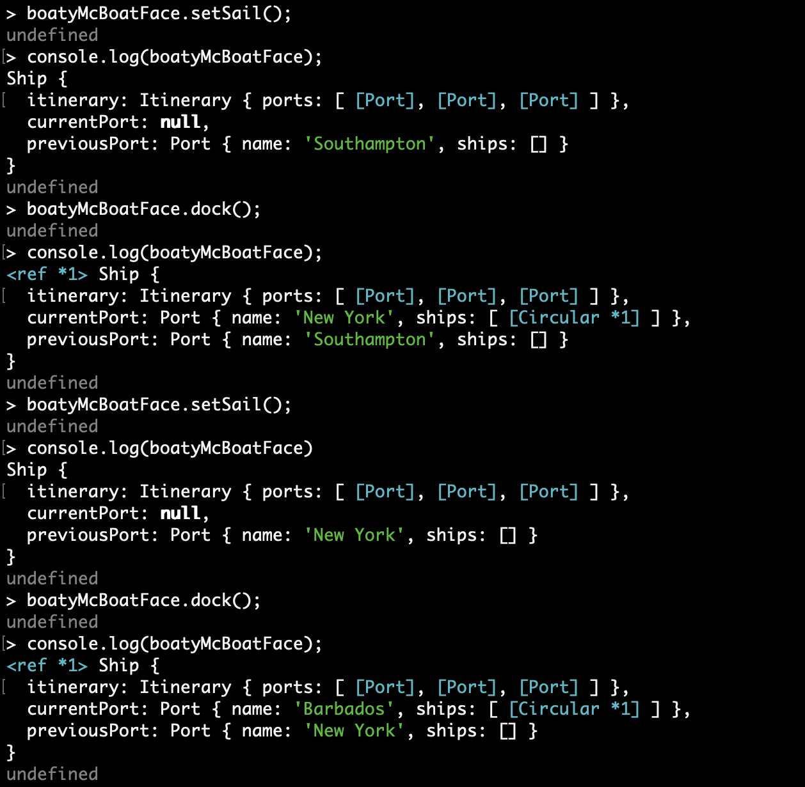

# Cruise ships

Another project created as part of my studies with [Command Shift](https://github.com/CommandShiftHQ)!

## Roadmap

- ~~follow and complete track~~
- follow and complete GUI track

### Installation & How to use

1. Clone down the repo to your computer
2. Type the following in your REPL so it knows where to look 👀

   ```javascript
   const Itinerary = require("path/to/Itinerary.js");
   const Port = require("path/to/Port.js");
   const Ship = require("path/to.Ship.js");
   ```

3. Now create some ports/destinations for your cruise ship!

   ```javascript
   const southampton = new Port("Southampton");
   const newYork = new Port("New York");
   const barbados = new Port("Barbados");
   ```

4. Add those ports/destinations to the ships itinerary

   ```javascript
   const shipItinerary = new Itinerary([southampton, newYork, barbados]);
   ```

5. Add the itinerary and the ship will be ready to sail!

   ```javascript
   const boatyMcBoatFace = new Ship(shipItinerary);
   ```

   

6. Use setSail() and dock() to sail the ship! See below for how that works ⬇️

   

7. If you setSail() from the final port you'll get an error telling you that you've come to the end of the itinerary!
8. You can have more than one ship in a port so have fun creating lots of different cruise to go on 🚢

## Application dependencies

JavaScript and Jest

## Support

Thank you to all the support from tutors and fellow coursemates at Command Shift 🙌

## Authors and acknowledgement

[codegregcode](https://www.linkedin.com/in/greg-cain/)
